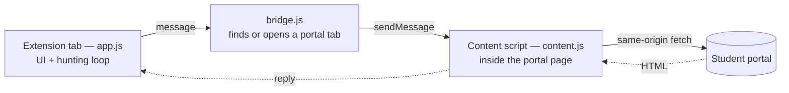

# Auto Move Class

**See which class still has room, which one collides with your timetable,
and take the seat the moment it opens.**

A Chrome extension for the student portal. No server, no account, no password —
it reuses the session already sitting in your browser.

---

## What it does

Moving class on the portal means opening a dropdown, picking a class blind, and
pressing Save into a wall of "class is full". This turns that into one screen.

|  | |
|---|---|
| **Headcounts at a glance** | Every open class, coloured by how full it is relative to the fullest one. The number is never cached for long — it changes by the minute, and it is the number the decision rests on. |
| **Clash detection** | Reads the schedule of *every* subject you are enrolled in and strikes out any class that collides. A clash is a hard constraint: it does not matter how much room a class has if you cannot attend it. |
| **Timetable view** | Open classes laid out on a real week grid, your current class marked ★, so you can see what the swap actually does to your week. |
| **Slot hunting** | Pick a class and the tool presses Save on a loop until a seat frees up. It backs off when the server is congested, says what it is waiting on, and stops the moment you tell it to. |
| **Recommendation** | Ranks the candidates — feasible first, then roomiest — and says *why*, so you are not asked to trust a number you cannot check. |

It deliberately **does not move you automatically**. It ranks and explains; the
decision stays yours, because it knows nothing about the constraints that are not
on the timetable — a job, friends in a class, a particular lecturer.

## Install

1. Open `chrome://extensions`
2. Turn on **Developer mode** (top right)
3. Click **Load unpacked** and pick this folder
4. Sign in to the portal the way you normally do
5. Click the extension icon in the toolbar

Requires Chrome 116 or newer.

## How it works

**Why the network calls do not happen in the extension page.** The first version
called `fetch()` straight at the portal, assuming `host_permissions` was enough.
It isn't, and it broke on the very first request with a `403`. A request from
`chrome-extension://…` is cross-origin and carries an
`Origin: chrome-extension://<id>` header, which the portal rejects outright.
`host_permissions` only settles the Chrome side of the question — whether the
request is served at all is decided on the server.

A content script running *inside* the portal page sends no `Origin` header, the
correct `Referer`, and `Sec-Fetch-Site: same-origin`, so its requests go through
normally. Hence the split: the UI lives in a long-lived extension tab, and every
network call is relayed through a portal tab.

**Why a tab and not a popup.** A hunt can run for hours. A popup dies the moment
you click elsewhere, and an MV3 service worker is stopped by Chrome after ~30
seconds idle. A tab lives exactly as long as the tab does, so `background.js`
does one thing only — open the tab — and everything heavy lives in `app.js`.

### Layout

| File | Job |
|---|---|
| `app.js` | UI, load orchestration, the hunting loop |
| `background.js` | opens the tool's tab, nothing else |
| `content.js` | makes the network calls from inside the portal page |
| `src/bridge.js` | finds or opens a portal tab, rebuilds it when closed |
| `src/fap.js` | the portal call layer: retries, backoff, error classification |
| `src/parse.js` | HTML parsers, and the traps that come with them |
| `src/advisor.js` | clash detection and candidate ranking |
| `src/store.js` | one place declaring what is cached, for how long, and why |

## Cache boundaries

Retentions differ because the **rate of change** differs, not for convenience:

| Data | Cached | Why |
|---|---|---|
| Schedule of open classes | 7 days | unchanged for the whole term |
| Subject → department table | whole term | department numbers are fixed |
| Your enrolled subjects | 12 hours | changes when *you* move class — dropped at that moment |
| Your attendance schedule | 12 hours | same |
| **Class headcount** | **30 minutes, always re-read** | changes because of *other people*, by the minute |

Two rules that are easy to get wrong:

- A cached schedule is only usable if it covers **every** class in the dropdown.
  The school opening extra classes mid-term is routine, and a newly opened class
  is exactly the one worth looking at.
- Dropdown `value`s **always** come from the page just loaded, never from cache.
  Reusing an old value after the portal renumbers its options moves you into the
  wrong class — a real failure, not a display glitch.

## Privacy

No server. Nothing is sent to the developer or to any third party. The extension
talks to exactly one host, using the login session already in your browser, and
everything it remembers lives in `chrome.storage.local` on your machine.

It never sees your password: there is no password field, the portal's login page
is never embedded in the UI, and nothing you type is read. When you are signed
out it opens a real tab at the portal's own login page — address bar and padlock
intact — and simply asks the portal when you are done.

Class rosters are **never stored**; names and photos are drawn on screen and gone
when you close the tab. The portal only exposes the roster of a class you are
enrolled in, and the code deliberately refuses arbitrary group ids so URL
enumeration is not possible.

Full detail in **[PRIVACY.md](PRIVACY.md)**.

## Engineering notes

Traps found the hard way, kept as comments in the source:

- **`lblNewSlot` keeps its original string.** "Tidying" it deletes the comma
  separating two sessions, leaving every class with one session per week.
- **The attendance table is found by content, not by `#divDetail`.** The portal
  puts a `
` directly inside a `<tr>`; the browser foster-parents it out of
  the table and leaves an empty div behind. Selecting by id gets you the shell,
  no rows, and it all looks like an empty page despite an HTTP 200.
- **Headcounts scan every matching row.** The first match can be a header row
  with no class link in it — taking only the first row once produced "0 results"
  across all 17 departments while the data sat right there.
- **A headcount is only accepted in the exact `| 28-(` shape.** Matching "any
  nearby number" pulls `170` out of the class name `SE1705` — plausible enough
  that nobody questions it, and wrong enough to send you hunting a full class.
- **Headcounts are collected from every department.** Soft-skill subjects name
  their classes after the major, so they are spread across many departments.
- **The subject on the returned page is cross-checked against the one requested.**
  Without it, the portal can hand back a different subject's page while the
  heading still shows what you clicked — which once meant clicking `WDU203c` and
  getting the 29 classes of `SSG105`.
- **The move-class control is not a link.** It is an ASP.NET `LinkButton`, so
  `MoveSubject.aspx` does not exist until its `__doPostBack` target is POSTed.

## Roadmap

- [ ] Class roster with photos wired into the UI (`getRoster` is written)
- [ ] HTML export of the class list
- [ ] Discord / Telegram notifications when a seat opens

## A note on use

The hunting loop presses Save repeatedly against a server that is already busiest
exactly when you want to use it. It backs off on congestion (1.5s → 20s), caps
concurrency, and stops when told to — please leave those limits alone, and stop
the hunt when you no longer need it.

## License

No license has been chosen yet, which means default copyright applies. Open an
issue if you need one.
